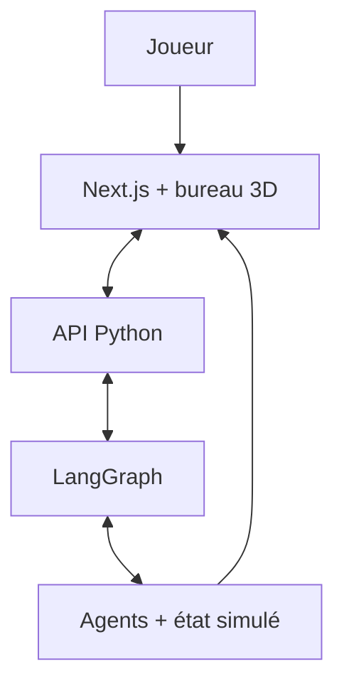

# Project Meltdown

## Concept

**Project Meltdown** est un serious game de gestion de crise dans lequel l’utilisateur dirige un projet numérique en difficulté.

Les employés, le client et la direction sont incarnés par des agents autonomes. Chacun possède ses propres informations, objectifs, émotions et relations. Après chaque décision du joueur, les agents planifient et exécutent leurs propres actions, parfois en coopération et parfois contre les intérêts du projet.

L’objectif pédagogique est d’apprendre à :

* prioriser sous pression ;
* communiquer avec différentes parties prenantes ;
* déléguer efficacement ;
* gérer les risques techniques, humains et commerciaux ;
* anticiper les conséquences indirectes d’une décision ;
* analyser une crise après son déroulement.

## Première crise proposée

### « La livraison impossible »

L’équipe doit livrer une version importante dans trois jours.

Simultanément :

* le développeur principal découvre une faille de sécurité ;
* le client exige une fonctionnalité supplémentaire ;
* le commercial a déjà promis cette fonctionnalité ;
* un développeur commence à s’épuiser ;
* la direction refuse initialement de repousser la livraison.

Le joueur ne possède pas toutes les informations dès le début. Les agents décident de ce qu’ils révèlent, cachent, transmettent ou amplifient.

## Boucle principale

1. Le joueur reçoit un briefing incomplet.
2. Il observe le bureau, les personnages et les indicateurs du projet.
3. Il consulte les messages, alertes et tâches disponibles.
4. Il prend une ou deux décisions : déléguer, négocier, repousser, enquêter, communiquer ou réaffecter des ressources.
5. La simulation avance d’un tour.
6. Chaque agent observe la nouvelle situation et choisit une action.
7. Les conséquences apparaissent dans le bureau 3D et les indicateurs.
8. À la fin, un agent pédagogique produit un débriefing argumenté.

L’application n’est donc pas centrée sur une conversation. Le joueur agit principalement depuis un **tableau de commandement**.

## Agents du MVP

| Agent                    | Objectif privé                        | Comportements possibles                                            |
| ------------------------ | ------------------------------------- | ------------------------------------------------------------------ |
| **Lead Developer**       | Protéger la qualité technique         | Corriger, alerter, refuser une tâche, accumuler de la dette        |
| **Client**               | Obtenir rapidement le produit attendu | Négocier, menacer, changer les priorités, perdre confiance         |
| **Commercial**           | Préserver le contrat                  | Faire des promesses, minimiser les risques, influencer le client   |
| **Responsable sécurité** | Empêcher un incident                  | Auditer, bloquer la livraison, escalader vers la direction         |
| **Directeur**            | Protéger budget et réputation         | Imposer une décision, accorder des ressources, remplacer quelqu’un |
| **Game Master**          | Faire évoluer la crise                | Déclencher les événements et contrôler le rythme                   |
| **Coach pédagogique**    | Évaluer l’apprentissage               | Observer les décisions et produire le débriefing final             |

Pour le premier prototype, quatre personnages visibles suffisent : développeur, client, commercial et sécurité. Le directeur peut apparaître uniquement sous forme de messages.

## État de la simulation

Chaque personnage possède notamment :

* confiance envers le joueur ;
* stress ;
* motivation ;
* charge de travail ;
* informations connues ;
* objectifs personnels ;
* mémoire des décisions précédentes.

Le projet possède des indicateurs globaux :

* temps restant ;
* budget ;
* avancement ;
* qualité ;
* risque de sécurité ;
* satisfaction du client ;
* moral de l’équipe ;
* réputation de l’entreprise.

Les agents n’ont pas accès à tout l’état. Par exemple, le commercial peut ignorer la gravité réelle de la faille tandis que le développeur ignore ce qui a été promis au client.

## Architecture agentique

Le bon équilibre consiste à laisser le LLM décider des intentions et à confier au moteur de jeu l’application des règles.

À chaque tour :

* LangGraph déclenche les agents concernés ;
* chaque agent reçoit seulement son contexte autorisé ;
* il choisit une action structurée ;
* le moteur vérifie si cette action est valide ;
* les métriques et relations sont recalculées ;
* les événements sont transmis à l’interface.

LangGraph convient bien ici parce qu’il permet de mélanger des étapes déterministes avec des décisions agentiques, tout en conservant un état persistant et observable. [Documentation LangGraph](https://docs.langchain.com/oss/python/langgraph/overview)

## Architecture technique proposée

### Backend

* Python ;
* LangChain pour les modèles, outils et sorties structurées ;
* LangGraph pour orchestrer les tours et conserver l’état ;
* FastAPI pour exposer l’API ;
* SQLite pour le MVP ;
* SSE ou WebSocket pour transmettre les événements en direct.

### Frontend

* Next.js avec App Router ;
* TypeScript ;
* Three.js via **React Three Fiber**, plus naturel dans React ;
* modèles low-poly au format GLTF ;
* interface 2D superposée à la scène 3D.

React Three Fiber permet de construire la scène Three.js sous forme de composants React interactifs. [Documentation React Three Fiber](https://r3f.docs.pmnd.rs/getting-started/introduction)

## Utilisation du bureau 3D

Le bureau 3D ne doit pas être purement décoratif. Il représente l’état réel des agents :

* un personnage se déplace vers un collègue pour communiquer ;
* un agent stressé change d’animation ;
* une réunion rassemble plusieurs personnages ;
* une bulle indique l’action en cours ;
* les bureaux deviennent désordonnés lorsque la charge augmente ;
* un personnage peut partir, s’isoler ou quitter l’entreprise ;
* les problèmes importants apparaissent visuellement sur les écrans ou dans la salle.

Les décisions restent prises dans une interface 2D claire : tâches, messages, chronologie et indicateurs.

## Débriefing pédagogique

À la fin, le coach ne donne pas seulement un score. Il reconstruit les conséquences :

* décision initiale ;
* réaction de chaque agent ;
* effet immédiat ;
* conséquence indirecte ;
* compétence de gestion concernée ;
* stratégie alternative possible.

Exemple :

> Tu as accepté la demande du client sans consulter l’équipe. La confiance du client a augmenté temporairement, mais la charge du développeur a provoqué une erreur supplémentaire et retardé la correction de sécurité.

