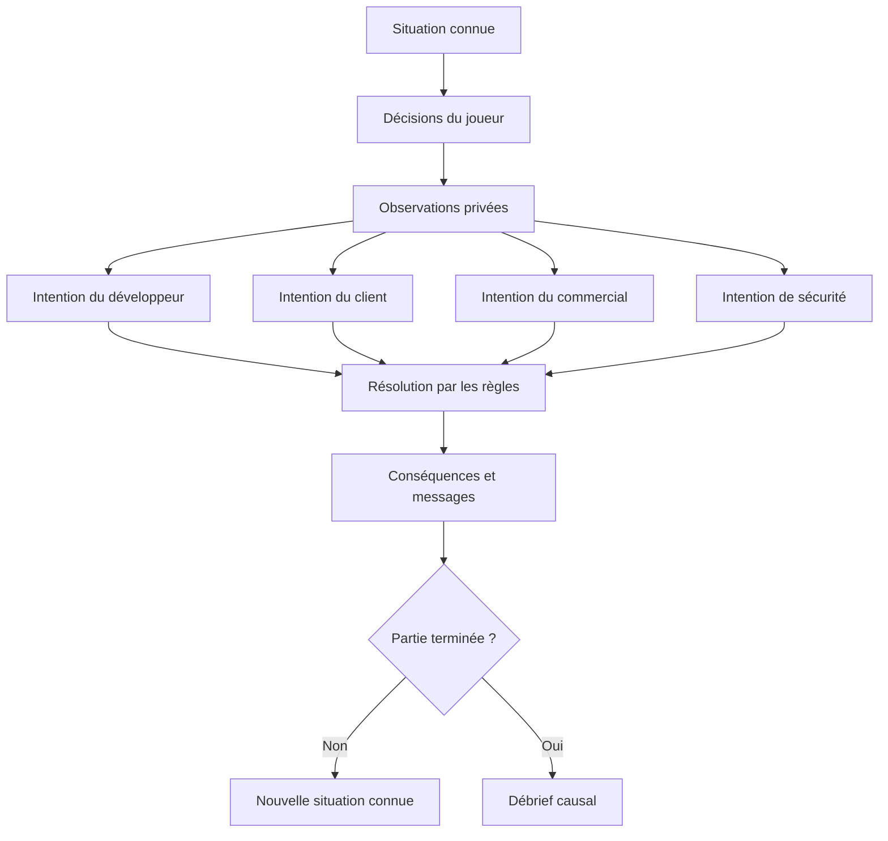
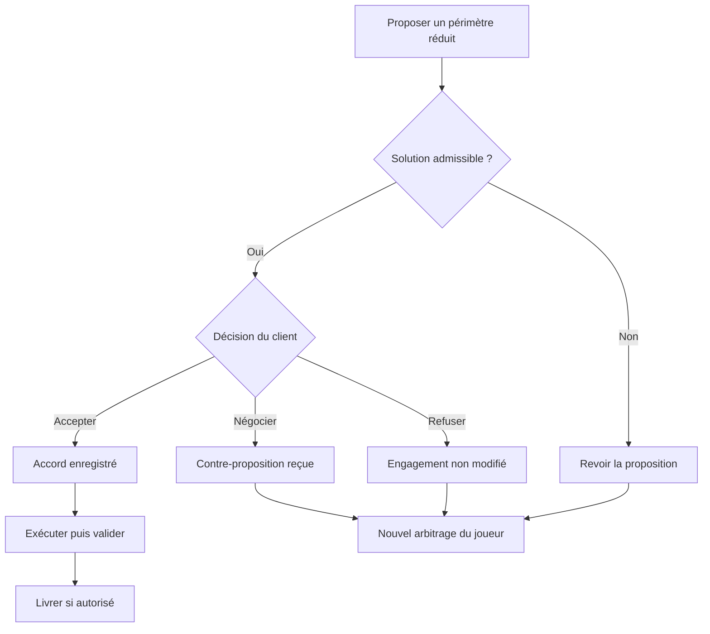

# Project Meltdown — branches de jeu et décisions des agents

Date : 3 septembre 2026. **Brouillon de conception pour discussion.** Les branches décrites sont des possibilités proposées, pas des résultats observés. Aucun moteur n'est implémenté.

Ce document précise le [cadrage](cadrage.md) et alimente le [rapport](rapport.md).

**Clarification de la demande :** ce document explore les branches narratives. Le graphe technique demandé par l'utilisateur est désormais décrit dans [graphe-orchestration.md](graphe-orchestration.md), qui fait référence pour l'ordre d'exécution et la redistribution des agents.

## 1. Structure recommandée : des jalons et un état partagé

Trois approches sont possibles :

| Approche | Intérêt | Limite pour ce projet |
| --- | --- | --- |
| Arbre entièrement écrit | Chaque chemin est facile à raconter et à vérifier | Beaucoup de branches à écrire ; faible influence réelle des agents |
| **Jalons écrits et réactions autonomes encadrées** | Une crise lisible, avec des conséquences différentes selon les agents et l'historique | Demande des règles explicites pour les actions, informations et conflits |
| Simulation très ouverte | Grande liberté d'instructions et d'interactions | Périmètre, rythme et explications plus difficiles à maîtriser |

La deuxième approche est recommandée. Le scénario fournit une échéance et des occasions de décision. L'état détermine les options disponibles ; les agents choisissent parmi leurs actions autorisées ; le moteur en calcule les effets.

Deux parcours peuvent rejoindre la même étape narrative sans effacer leurs différences de budget, charge, confiance ou connaissances. Un joueur peut aussi changer de stratégie après un mauvais départ.

## 2. Forme d'un tour

Ce schéma simplifie la résolution en une étape. Le graphe technique propose désormais jusqu'à deux rondes internes : les intentions d'une ronde partent du même instantané filtré, puis les messages validés deviennent disponibles aux destinataires à la ronde suivante. Les messages restants à la limite des rondes attendent le prochain tour. Le joueur voit les messages qui lui sont adressés à la restitution du tour.

Le moteur peut appliquer immédiatement un blocage valide sans attendre que les autres personnages en aient connaissance. L'exécution d'une action et la connaissance de cette action sont deux choses distinctes.

## 3. Situation initiale proposée

Le joueur voit une livraison proche, une demande supplémentaire, une alerte technique non qualifiée et une équipe déjà chargée. Il ne connaît pas encore tous les engagements et contraintes des personnages.

| Personnage | Informations initiales proposées | Objectif privé | Ce qui influence ses choix |
| --- | --- | --- | --- |
| Lead developer | A repéré le défaut ; connaît l'effort estimé et sa capacité réelle | Livrer un travail fiable sans surcharge intenable | Charge, clarté des priorités, confiance, alertes précédentes |
| Client | Connaît sa propre échéance métier et ce que le commercial lui a promis | Réussir son échéance avec un produit utilisable | Promesses, preuves d'avancement, transparence, solutions de repli |
| Commercial | Connaît sa promesse et les enjeux du contrat ; ignore la gravité technique réelle | Préserver le contrat et sa crédibilité | Pression client, relation avec le joueur, informations reçues |
| Sécurité | Connaît les exigences de validation ; reçoit un signal à examiner, sans preuve complète | Éviter une mise en service présentant un risque critique établi | Résultats d'audit, exposition, réponse aux alertes |

**Suggestion de fait caché à discuter :** l'échéance du client pourrait concerner une démonstration plutôt qu'une utilisation en production. Une démonstration limitée pourrait alors devenir négociable. Cette possibilité n'existe que si le scénario la définit ; le modèle ne peut pas l'inventer pour résoudre une difficulté.

Chaque information d'enquête possède une source et un résultat défini par l'état du scénario. Le modèle choisit comment communiquer un fait qu'il connaît ; une affirmation d'un personnage reste distincte d'un fait vérifié. Les engagements contradictoires sont conservés comme tels.

## 4. Les six jalons

Les intitulés donnent un rythme narratif. Ils ne forcent ni une crise ni un choix particulier si l'état ne le justifie pas.

| Tour | Question centrale | Exemples de décisions | Branches conditionnelles |
| --- | --- | --- | --- |
| 1 — Comprendre | Que faut-il vérifier en premier ? | Auditer, consulter la capacité, clarifier le besoin client, démarrer une tâche | Risque mieux qualifié, besoin découvert, travail engagé sans diagnostic complet |
| 2 — S'engager | Que promet-on et à qui ? | Confirmer une livraison, négocier un périmètre, demander un report, communiquer les preuves | Accord, contre-proposition, refus, promesses contradictoires |
| 3 — Exécuter | Où va la capacité disponible ? | Prioriser le correctif, affecter la fonctionnalité, réduire la charge, isoler un module | Avancement, surcharge, coopération, tâche refusée ou suspendue |
| 4 — Réévaluer | Le plan tient-il encore ? | Réviser une promesse, demander du renfort, partager un audit, poursuivre un plan viable | Confiance restaurée, conflit qui persiste, blocage technique, plan stabilisé |
| 5 — Préparer la livraison | Qu'est-ce qui est réellement livrable ? | Faire valider, proposer une livraison partielle, finaliser un report | Autorisation, correction encore nécessaire, accord conditionnel |
| 6 — Assumer le résultat | Que livre-t-on à l'échéance ? | Livrer un périmètre autorisé, acter un report accepté, renoncer à une livraison risquée | Bilan selon le produit livré, les engagements, le risque et l'équipe |

Les actions restent disponibles en dehors de leur jalon illustratif lorsque leurs préconditions sont réunies. Une rupture de contrat ou un incident critique peut terminer la partie plus tôt. Un report accepté ne rajoute pas de tours : le bilan indique ce qui a été renégocié et ce qui reste à faire.

## 5. Trois ouvertures possibles

Ces ouvertures illustrent une première décision ; elles ne constituent pas des routes exclusives. Avec deux décisions par tour, le joueur peut par exemple lancer un audit puis clarifier le besoin client. Les résultats d'un audit demandé pendant le tour ne sont connus qu'après sa résolution.

| Première décision | Réactions possibles pendant la résolution | Conséquence différée possible | Décision qui se présente ensuite |
| --- | --- | --- | --- |
| Donner priorité à la fonctionnalité | Le lead accepte une affectation tenable ou refuse une surcharge ; le commercial peut confirmer sa promesse ; sécurité peut choisir d'auditer | La promesse est renforcée alors qu'un audit révèle un risque et que la capacité manque | Réviser le périmètre, renégocier, réaffecter une ressource |
| Demander l'audit du défaut | Sécurité produit une preuve selon le scénario ; le lead poursuit le travail compatible avec sa capacité ; le commercial peut communiquer son inquiétude | Une correction prioritaire ou une isolation devient justifiable | Protéger la capacité du correctif, partager la preuve, proposer une livraison limitée |
| Clarifier l'échéance client | Le client peut partager son besoin réel ou rester sur l'engagement initial ; le commercial peut soutenir ou contester la clarification | Une alternative devient négociable, ou le désaccord sur la promesse apparaît | Formaliser une proposition, apporter des preuves, maintenir une autre stratégie |

Une action seule ne mène pas automatiquement à une fin. Les effets dépendent des préconditions, de l'état et des intentions effectivement retenues.

## 6. Exemple détaillé : négocier une livraison partielle

Ce schéma montre seulement la branche de négociation ; les autres personnages continuent à prendre leur propre décision à chaque tour.

La recevabilité de la proposition vient des règles et de l'état : besoin métier découvert si nécessaire, périmètre techniquement possible, capacité et conditions contractuelles du scénario. Parmi ses réponses autorisées, le client tient compte de sa confiance, des preuves reçues et de ses objectifs.

Une contre-proposition n'est pas un accord. Un accord client ne constitue pas une validation technique. Une validation technique ne garantit pas la satisfaction du client. Le joueur doit coordonner ces engagements distincts.

## 7. Autonomie de chaque personnage

| Agent | Intentions possibles | Pouvoir réel et limite |
| --- | --- | --- |
| Lead developer | Poursuivre, demander une clarification, signaler un risque, proposer une autre affectation, refuser une surcharge | Peut influer sur l'exécution et révéler une contrainte ; ne crée pas de capacité supplémentaire |
| Client | Accepter, demander une concession, refuser, rappeler une promesse, escalader | Peut modifier un engagement selon les règles ; ne déclare pas le logiciel techniquement sûr |
| Commercial | Partager la promesse initiale, défendre un compromis, reformuler une attente, promettre dans son mandat, escalader | Peut créer ou entretenir une attente ; une promesse ne crée pas automatiquement une tâche validée par le joueur |
| Sécurité | Auditer, partager une preuve, recommander une isolation, demander une correction, demander un blocage | Peut déclencher les actions prévues par les preuves ; ne peut pas inventer une faille ou déclarer un correctif réussi |

Les contraintes impératives sont appliquées par le moteur. Par exemple, une preuve critique qui active une interdiction de livraison ne peut pas être contournée par une réponse du modèle. Les états de risque non encore établis restent distincts des preuves connues.

Les personnages gardent une possibilité de coopération. Le commercial n'est pas condamné à mentir ; sécurité n'est pas condamnée à bloquer ; le client n'est pas condamné à refuser. Les événements passés doivent rendre leurs réactions compréhensibles.

## 8. Travail, actions et information

- Lire les messages et consulter les informations déjà accessibles est gratuit.
- Enquêter, affecter une tâche, faire une proposition ou lancer une communication formelle utilise une des deux décisions de gestion du tour.
- Une tâche acceptée reste affectée et progresse selon les règles ; le joueur n'a pas à la redemander à chaque tour.
- Le travail déjà affecté est calculé par le moteur. Une intention de communication ne suspend pas automatiquement ce travail ; un refus ou une réaffectation validés peuvent le suspendre.
- Chaque agent dispose d'au maximum une initiative structurée par ronde, avec deux rondes proposées par tour. Les coûts et préconditions sont vérifiés à chaque fois, mais le temps et la progression du travail ne sont calculés qu'une fois par tour. Ses paroles ne doivent pas introduire des actions supplémentaires non validées.
- Une nouvelle information peut ouvrir une option concrète ; une confiance accrue influence la réponse à une offre sans garantir son acceptation.
- Un message libre éventuellement attaché à une carte ne fournit ni capacité supplémentaire ni décision gratuite. Pour le MVP recommandé, la carte détermine l'action et ses paramètres ; le texte sert à l'expliquer.

Le degré de liberté de saisie du joueur fait l'objet d'une question de conception ouverte : cartes seules, cartes avec message, ou instructions principalement libres.

## 9. Fins et lecture pédagogique

Le bilan repose sur plusieurs dimensions : périmètre effectivement livré, engagements respectés ou renégociés, sécurité, coût et état de l'équipe. Le titre narratif résume ces faits sans les remplacer.

Exemples de bilans possibles :

- **Livraison maîtrisée** : un périmètre validé est livré conformément à l'accord obtenu.
- **Report négocié** : le produit n'est pas livré dans la fenêtre initiale, mais une nouvelle échéance a été acceptée.
- **Livraison au prix fort** : le produit et l'accord sont satisfaits avec une équipe épuisée ou un budget fortement consommé.
- **Projet bloqué** : le travail reste insuffisant ou la livraison interdite sans solution acceptée.
- **Crise majeure** : un incident ou une rupture de contrat prévu par les règles survient.

Ces descriptions peuvent se recouper : le bilan conservera toutes les dimensions. Les seuils numériques et la priorité des titres ne sont pas encore fixés.

Pour chaque moment important, le coach doit distinguer : informations disponibles à l'époque, décision prise, réaction réelle des personnages, effets appliqués et alternative hypothétique. Il ne pénalise pas une personne comme si elle connaissait déjà un fait révélé après sa décision ; il peut analyser une occasion d'enquête ignorée si elle était visible.

## 10. Ce qu'il faudra vérifier avant de figer le scénario

1. Deux stratégies aboutissent-elles à des conséquences différentes mais explicables ?
2. Peut-on se remettre d'une première décision défavorable ?
3. Chaque personnage peut-il changer un événement ou un engagement, au-delà de reformuler un message ?
4. Les premiers signaux donnent-ils une possibilité raisonnable de découvrir les risques importants ?
5. Une stratégie viable évite-t-elle qu'une nouvelle crise soit imposée artificiellement au tour 4 ?
6. Une action paraît-elle toujours supérieure, quelles que soient les informations et contraintes ?
7. Les intentions par ronde et les transmissions différées produisent-elles une chronologie cohérente ?

La discussion en cours porte sur le graphe technique d'orchestration. La forme des instructions du joueur reste ouverte mais n'est pas nécessaire pour décrire ce graphe ; les valeurs, seuils et coûts seront calibrés ultérieurement.
