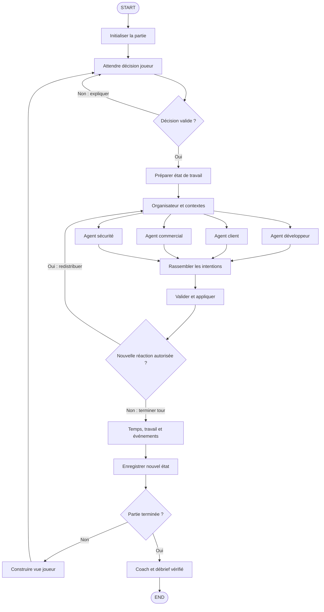

# Project Meltdown — graphe LangGraph d'un tour

**État au 3 septembre 2026 :** ce graphe a été approuvé et une première implémentation locale existe dans `backend/meltdown/graph.py`. Le [graphe exporté](evidence/langgraph.mmd) montre les nœuds effectifs ; le [rapport](rapport.md) précise les adaptations et vérifications.

## 1. Deux boucles

La boucle externe attend une décision du joueur entre deux tours. La boucle interne distribue le travail aux personnages, rassemble leurs intentions et peut redistribuer les événements à d'autres personnages pendant le même tour.

Les flèches vers les personnages représentent des destinations possibles. L'organisateur connaît la liste exacte des agents sélectionnés ; la collecte attend uniquement les résultats de cette liste, pas des personnages non appelés. Une distribution vide rejoint directement la clôture du tour.

## 2. Responsabilités des nœuds

| Nœud | Entrée principale | Sortie | Nature proposée |
| --- | --- | --- | --- |
| Attente joueur | Vue publique du dernier état validé | Décision ou lot de décisions du tour | Pause LangGraph |
| Validation | Décision, version et état canonique | Erreur explicite ou décision normalisée | Code ; interprétation LLM facultative si saisie libre |
| Préparation | État canonique et décision recevable | État de travail, coûts du joueur appliqués une fois, compteurs initialisés | Code |
| Organisateur | État de travail, messages en attente, tour et ronde | Agents sélectionnés et observation privée pour chacun | Code de routage pour le MVP |
| Personnage | Observation privée, mémoire, objectifs et actions autorisées | Intention structurée, messages proposés et références aux faits connus | LLM avec sortie structurée |
| Collecte | Résultats de la distribution courante | Ensemble d'intentions identifié par tour, ronde et agent | Fusion technique des sorties |
| Résolution | Intentions collectées et état de travail | Intentions acceptées/rejetées, événements et nouvel état de travail | Règles déterministes |
| Routage suivant | Événements, destinataires, budgets et état terminal | Nouvelle distribution ou clôture | Code |
| Clôture | État de travail résolu | Avancement des tâches, temps écoulé, événements du scénario et bilan du tour | Code |
| Enregistrement | Tour finalisé | État canonique versionné et journal causal | Écriture idempotente |
| Vue joueur | État canonique et événements | Informations autorisées, messages visibles, prochaines actions possibles | Projection filtrée |
| Coach | Historique validé et faits pertinents | Explication reliée aux événements, puis contrôle des références | LLM et vérification par code |

La collecte LangGraph fusionne des **propositions**. Elle ne résout pas les conflits métier et ne somme pas aveuglément des modifications de budget ou de charge envoyées par les agents. Seul le moteur de règles possède le droit de modifier les faits et métriques de simulation.

L'organisateur orchestre les personnages ; il ne choisit pas leurs décisions à leur place. Son implémentation de confiance peut consulter l'état serveur pour construire les observations. Si un LLM d'organisation est ajouté ultérieurement, son contexte et ses pouvoirs devront être définis séparément de ceux des personnages.

## 3. Interactions pendant un même tour

Proposition MVP : **deux rondes au maximum par tour**, chacune avec au plus un appel par personnage.

- Ronde 1 : les quatre personnages actifs reçoivent chacun une occasion d'agir, même sans sollicitation directe du joueur. Cela conserve leurs objectifs autonomes. L'organisateur prépare des contextes différents selon la décision et les messages déjà disponibles.
- Après la résolution de la ronde 1, les messages et événements validés deviennent disponibles uniquement à leurs destinataires autorisés.
- Ronde 2 : seuls les personnages ayant une réaction à traiter sont redistribués. Ils peuvent répondre à un message ou adapter leur intention selon les règles et capacités restantes.
- Après la ronde 2, les nouvelles réactions qui ne peuvent plus être traitées restent en attente pour le prochain tour. Elles ne disparaissent pas.
- Une fin de partie détectée empêche une nouvelle distribution. La clôture respecte cet état terminal et n'accorde pas de progression de travail postérieure à la fin.

Cela représente au plus huit appels aux personnages par tour dans cette proposition. L'organisateur reste du code ; le coach n'est appelé qu'à la fin. Une sortie invalide ou un délai dépassé reçoit un résultat de secours sans boucle de réparation LLM dans ce premier budget.

Tous les personnages d'une même ronde voient un instantané cohérent, filtré individuellement. Ils ne lisent pas les sorties des voisins en cours de génération. Une nouvelle ronde constitue un nouvel instantané après résolution.

Les actions doivent respecter leurs coûts et préconditions à chaque ronde. La progression du travail, les coûts récurrents et le temps simulé sont calculés **une seule fois**, à la clôture du tour. Redistribuer un agent ne lui accorde pas une seconde journée de travail.

Cette proposition remplace l'hypothèse précédente d'une seule intention par personnage et de messages entre agents systématiquement reportés au tour suivant. Il s'agit d'un ajustement proposé du fonctionnement, pas d'un choix déjà implémenté.

## 4. Exemple de passage dans le graphe

Décision du joueur : « Prioriser le correctif et informer le client du risque sur la date ».

1. La validation vérifie les deux décisions et la capacité ; la préparation les intègre à l'état de travail.
2. L'organisateur distribue les observations de ronde 1. Le développeur voit l'affectation ; le client voit le message qui lui est destiné ; sécurité voit les faits techniques qu'elle connaît ; le commercial garde sa propre information.
3. Le développeur peut accepter la correction. Le client peut demander au commercial une clarification sur la promesse. Sécurité peut proposer un audit. Le commercial peut poursuivre son initiative initiale sans connaître la demande que le client vient de produire.
4. La collecte attend ces résultats. Le moteur valide les propositions, applique les effets autorisés et enregistre le message client vers le commercial.
5. L'organisateur redistribue le commercial en ronde 2 avec cette nouvelle demande, ainsi que tout autre personnage ayant une réaction autorisée. Le commercial peut reconnaître la contradiction ou défendre son engagement.
6. Le moteur résout ces réactions. Un nouveau message vers le client attend le prochain tour si les deux rondes sont consommées.
7. La clôture calcule une seule période de travail et les événements dus. Le nouvel état est enregistré ; le joueur reçoit les conséquences auxquelles il a accès et peut décider à nouveau.

Ce déroulé est illustratif. Les intentions restent choisies par les personnages parmi les options recevables.

## 5. État du graphe

| Ensemble | Contenu proposé |
| --- | --- |
| Identification | Identifiant de partie, version, identifiant de requête et statut |
| Simulation | Tour, métriques, tâches, capacité, engagements et faits du scénario |
| Personnages | Connaissances, relations, objectifs, mémoire et messages privés |
| Décision joueur | Entrée reçue, forme normalisée, validation et coûts |
| Orchestration temporaire | Numéro de ronde, agents attendus, observations filtrées, intentions collectées et budgets |
| Événements | Identifiants, causes, destinataires, tour/ronde et messages en attente |
| Restitution | Vue publique, actions possibles et débrief éventuel |

L'état canonique validé et l'état de travail doivent être distingués. Le navigateur reçoit uniquement la projection publique. Les tableaux d'intentions sont séparés par tour/ronde et fusionnés par identifiants stables afin d'éviter des réapplications lors des reprises.

## 6. Correspondance LangGraph

- `StateGraph` porte l'état et les nœuds de cette proposition.
- `Send` permet au routage de distribuer un contexte propre à chaque personnage. Les résultats des workers peuvent être agrégés dans un champ partagé avec un reducer. [Graph API](https://docs.langchain.com/oss/python/langgraph/graph-api), [orchestrator-worker](https://docs.langchain.com/oss/python/langgraph/workflows-agents).
- Des arêtes conditionnelles décident de redistribuer, de finaliser ou d'aller au coach. Un nœud worker peut ultérieurement devenir un sous-graphe si plusieurs étapes internes sont nécessaires. Le MVP n'impose pas cette complexité.
- `interrupt()` marque l'attente du joueur. Une reprise par `Command(resume=decision)` utilise le même `thread_id` et un checkpointer. Le nœud interrompu recommence au début lors de la reprise : les écritures et effets doivent rester en dehors de sa partie rejouée ou être idempotents. [Interrupts](https://docs.langchain.com/oss/python/langgraph/interrupts).
- Le checkpointer conserve l'exécution. Les enregistrements applicatifs de partie doivent être reliés au tour et à la requête, avec une écriture idempotente et reprise du résultat déjà enregistré si la reprise du graphe survient après le commit. [Persistence](https://docs.langchain.com/oss/python/langgraph/persistence).

Les noms de primitives sont issus de la documentation officielle consultée le 3 septembre 2026 ; les nœuds, budgets et frontières métier constituent notre proposition de conception.

## 7. Points de vérification futurs

Vérifier les observations privées, la collecte complète des agents sélectionnés, l'ordre stable de résolution, l'absence de double progression du temps, la conservation des messages différés et les reprises après timeout ou double envoi. Un agent en échec doit produire un résultat de secours pour que la barrière de collecte puisse se terminer. Le coach dispose d'un bilan déterministe de secours.

Le graphe doit se mettre en attente après chaque tour validé et ne jamais inventer la prochaine décision du joueur. Les streams bruts de l'état ou des modèles ne doivent pas être exposés au navigateur : construire des événements publics explicitement filtrés.
