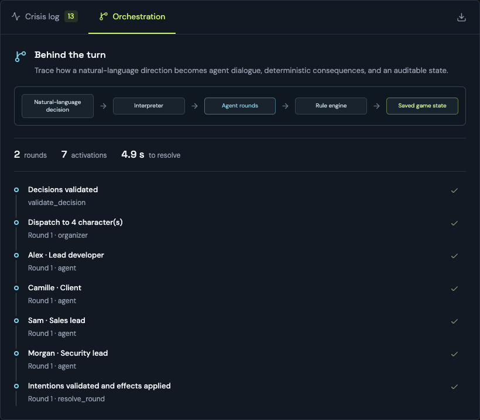

# Project Meltdown — rapport de hackathon

**Version mise à jour du 5 septembre 2026 — MVP local en anglais, bureau Three.js intégré et parcours complet vérifié dans un navigateur avec le modèle OpenAI configuré.** Le rapport suit le produit depuis le briefing jusqu'au débrief, puis explique les choix d'architecture, de méthodologie et de technologies qui rendent ce parcours possible. Les consignes officielles du hackathon, l'équipe et la répartition des contributions restent à renseigner avec leurs données réelles.

## 1. Résumé

Project Meltdown est un serious game de gestion de crise dans un projet numérique. Le joueur dispose de six tours pour arbitrer entre livraison, sécurité, demandes du client et capacité de l'équipe. Quatre personnages représentent le développement, le client, le commercial et la sécurité.

Le prototype comprend un tableau de commandement en anglais, un moteur de règles, un graphe LangGraph persistant, deux rondes d'interactions internes au maximum et un débrief lié aux événements enregistrés. Une partie complète jouée dans l'interface le 5 septembre 2026 constitue le fil conducteur du rapport : la livraison négociée aboutit en cinq tours avec 100 % de progression, un budget de 34/100, une confiance client de 73/100, un moral de 60/100 et une sécurité vérifiée.

Ces essais valident un premier fonctionnement technique. Ils ne démontrent ni l'efficacité pédagogique ni le réalisme des comportements d'un modèle de langage en conditions réelles.

## 2. Problématique et intention pédagogique

Comment simuler des parties prenantes qui disposent d'informations et d'objectifs différents, tout en conservant des conséquences vérifiables et une explication fidèle au déroulement de la partie ?

Les objectifs pédagogiques envisagés sont la priorisation sous pression, la recherche d'information, la négociation d'engagements et l'analyse des conséquences. Le joueur doit comprendre qu'un socle techniquement avancé ne constitue pas, à lui seul, une livraison acceptable : le périmètre doit être convenu et la sécurité validée.

Le public envisagé est constitué d'étudiants en informatique et de futurs chefs de projet. Aucun test d'apprentissage avec des participants n'a encore été mené.

## 3. Scénario et périmètre livré

Dans « La livraison impossible », une livraison est attendue dans trois jours. Le développeur a repéré un défaut, le client attend une fonctionnalité promise par le commercial et la capacité de l'équipe est limitée. Certaines informations sont connues d'un personnage mais pas encore du joueur.

Le joueur peut notamment auditer le défaut, prioriser le correctif ou le socle, clarifier le besoin métier, communiquer, négocier un périmètre réduit ou un report, accepter la fonctionnalité, réduire la charge, mobiliser du renfort, valider la correction puis livrer.

Le joueur donne une instruction libre ; le modèle la traduit en zéro, une ou deux décisions canoniques validées par le moteur. En cas d'ambiguïté, l'interface demande une confirmation avant d'avancer. Le travail accepté continue sans demander au joueur de le réaffecter à chaque tour.

L'interface livre les éléments suivants :

- Briefing de départ et création d'une partie.
- Indicateurs du socle, du budget, de la confiance, du moral et de l'état de sécurité connu.
- Quatre fiches de personnages avec activité observable et pression.
- Actions avec coût, préconditions et état indisponible explicite.
- Journal des événements et trace des activations du graphe par ronde.
- Sauvegarde côté serveur, reprise de la dernière partie et export JSON public.
- Débrief final avec liens vers les événements et pistes alternatives clairement présentées comme hypothèses.

Le bureau 3D est désormais intégré au tableau de commandement. Il est construit avec Three.js via React Three Fiber et Drei : géométrie low-poly procédurale, quatre personnages sélectionnables, bureaux, table de réunion, plantes, écran d'avancement et signal de sécurité. Aucun modèle externe n'est téléchargé.

La représentation utilise exclusivement la projection publique de la partie. Les négociations publiques du tour courant peuvent rapprocher le client ou le commercial de la table. Le niveau de pression influence la posture et le désordre du bureau. Le correctif vérifié change le signal de sécurité ; une livraison réussie produit une pose et un bandeau de fin. Ces positions et animations illustrent les événements, sans ajouter de conséquences métier ni révéler les messages privés.

Des boutons HTML permettent d’inspecter les personnages, de consulter leur événement source, de suspendre les animations, de réinitialiser la caméra et d’utiliser une vue 2D. Les pointeurs tactiles conservent le défilement vertical par défaut et exigent l’activation explicite du mode caméra. Les préférences de mouvement réduit et la visibilité de la scène contrôlent l'animation. L'absence ou la perte du contexte WebGL laisse les contrôles du jeu accessibles en 2D.

## 4. Architecture réalisée

Le frontend utilise Next.js, React et TypeScript, avec un module Three.js chargé à la demande côté client. Il appelle un proxy `/api` vers FastAPI. Python porte les règles, les personnages et l'orchestration. SQLite conserve les parties canoniques et les reçus de requêtes ; un second fichier SQLite conserve les checkpoints LangGraph.

Le [graphe conceptuel](graphe-orchestration.md) possède deux boucles. La boucle externe attend le joueur avec `interrupt()` puis reprend avec une décision. La boucle interne prépare les observations privées, distribue les agents avec `Send`, collecte les intentions, applique les règles et redistribue les réactions autorisées.

L'implémentation utilise un nœud worker `agent` paramétré par personnage. La première ronde active les quatre personnages ; la seconde sélectionne les destinataires des nouveaux messages. Les sorties sont rassemblées avec des clés stables par tour, ronde et personnage. Le graphe effectif est exporté depuis LangGraph dans [langgraph.mmd](evidence/langgraph.mmd).

La séparation entre workflow, état et agents s'appuie sur les primitives documentées par LangGraph. Les frontières métier, règles et budgets de rondes ont été conçus pour ce jeu. [Workflows et agents](https://docs.langchain.com/oss/python/langgraph/workflows-agents), [interruptions](https://docs.langchain.com/oss/python/langgraph/interrupts), consultés le 3 septembre 2026.

### Contrôle des conséquences

Un personnage propose une intention structurée. Le moteur vérifie l'action, les connaissances et les préconditions avant d'appliquer un effet. Les sorties concurrentes ne modifient pas directement les métriques. La progression du travail et les coûts périodiques sont calculés une seule fois à la clôture du tour.

Les intentions d'une ronde utilisent un instantané cohérent, filtré pour chaque personnage. Les messages validés deviennent utilisables à la ronde suivante. Les messages produits après consommation des deux rondes attendent le tour suivant. Une livraison autorisée termine le jeu sans déclencher de nouvelles activations de personnages.

### Persistance et reprises

Chaque décision porte une version attendue et un identifiant de requête. L'état et le reçu public sont enregistrés dans une transaction. Une nouvelle tentative identique reçoit le résultat déjà enregistré ; réutiliser un identifiant pour une autre décision est refusé.

Une reprise après un échec survenu juste après le commit canonique a été testée. Les checkpoints permettent de terminer l'exécution interrompue puis de reprendre une nouvelle décision sans consommer deux fois le tour.

La version actuelle sérialise les mutations dans un seul processus Python. Elle vise une démonstration locale et ne doit pas être présentée comme un service multi-utilisateur prêt à être exposé publiquement.

## 5. Agents LLM et débrief

Un modèle configuré via l'environnement est obligatoire. Les personnages reçoivent leur contexte filtré et choisissent une sortie structurée contenant une action, une réplique, une raison courte et une émotion. Le moteur reste seul responsable des effets factuels. Les appels ont un plafond de 384 tokens de sortie, un timeout de 20 secondes et une relance fournisseur. Une erreur persistante arrête la ronde dans un état sauvegardé ; le joueur peut alors la relancer explicitement. Le budget est limité à huit activations de personnages par tour ; la clôture d'une livraison peut en utiliser zéro.

Le coach LLM optionnel sélectionne et ordonne des moments parmi des événements déjà rédigés par le moteur. Les références sont validées ; le texte factuel reste celui des événements. Ce choix limite les affirmations causales inventées. Les relations enregistrées indiquent les décisions et messages pertinents ; elles ne prétendent pas révéler le raisonnement interne du modèle.

Des appels OpenAI réels ont été effectués sur le contrat précédent. Le choix évalué était **GPT-5.6 Luna**, raisonnement `none`, après comparaison avec GPT-5.4 nano et un essai de raisonnement `low`. Les 156 appels d'évaluation instrumentés représentent environ **0,0268 USD estimé**. Le [protocole détaillé](model-calibration.md) conserve ces mesures comme archive et indique comment évaluer le nouveau contrat. Les tests automatisés injectent un faux modèle et bloquent le réseau externe.

## 6. Validation du produit

Le 5 septembre 2026, une partie a été jouée dans un navigateur depuis le briefing jusqu'au débrief final. Le bureau 3D, la saisie libre, l'interprétation visible, les réponses des personnages, le journal, la livraison et le débrief ont été observés dans le produit en fonctionnement. Les captures présentées dans ce rapport proviennent de ce prototype.

La validation technique reste une preuve de soutien : 43 tests backend et 10 tests frontend passent, Ruff ne signale aucune erreur et le build de production Next.js réussit. Les contrôles portent principalement sur les règles, la confidentialité des observations, la persistance, la reprise d'une ronde et la cohérence de la projection publique. Le fichier [pytest.txt](evidence/pytest.txt) conserve une campagne historique détaillée.

Versions principales enregistrées : Python 3.12.13, Next.js 16.3.4, FastAPI 0.141.1, LangGraph 1.2.11, LangChain 1.3.18 et Pydantic 2.13.5. Les fichiers `uv.lock` et `web/package-lock.json` fixent les dépendances ; un relevé Python est disponible dans [versions.json](evidence/versions.json).

## 7. Parcours démontré et preuves visuelles

Les deux parcours ci-dessous ont été enregistrés avant le passage au runtime exclusivement LLM. Ils restent des preuves historiques du moteur déterministe, mais `scripts/demo.py` utilise désormais les personnages LLM configurés et n'étiquette plus de mode.

| Parcours | Issue | Budget final | Confiance client | Moral | Activations des personnages |
| --- | --- | --- | --- | --- | --- |
| Audit, correctif, clarification, communication et périmètre réduit | Livraison maîtrisée | 22/100 | 66/100 | 68/100 | 22 |
| Aucun nouvel ordre pendant six tours | Échéance non tenue | 28/100 | 30/100 | 51/100 | 25 |

Le socle atteint 100 % dans les deux parcours historiques, mais le second ne dispose pas des conditions de livraison : avancement, accord commercial et validation technique sont des dimensions distinctes.

Les fichiers [negotiated-delivery.json](evidence/negotiated-delivery.json) et [no-intervention.json](evidence/no-intervention.json) contiennent les décisions, métriques, rondes, événements et débriefs observés. Les durées internes de résolution y sont enregistrées ; ce petit échantillon local ne constitue pas un benchmark de performance.

### Essai avec le modèle réel

Le dernier parcours OpenAI enregistré avec l'ancien contrat atteint la livraison avec les mêmes métriques finales que le parcours négocié historique : budget 22, confiance 66 et moral 68. Il utilise 31 activations de personnages et un coach, 21 284 tokens d'entrée et 1 311 de sortie, soit **0,00583 USD estimé**. Une intention du développeur avait alors été remplacée par le secours désormais supprimé ; le coach final utilise des références valides. Les tours actifs durent de 3,0 à 14,6 secondes dans cet essai.

Les premiers passages ont révélé une proposition insuffisamment décrite, des identifiants de coach ambigus et une confusion unités/périodes. Ces points ont été corrigés dans le contexte et protégés par des tests. La [trace finale](evidence/model-evaluation-final.json) et les [essais intermédiaires](model-calibration.md) restent disponibles, y compris les échecs observés.

L'interface, les messages système des agents, les événements, erreurs et débriefs sont en anglais ; ce rapport reste en français. Les anciennes sauvegardes françaises sont conservées, avec un identifiant de reprise distinct pour les parties anglaises.

### Validation navigateur du 5 septembre 2026

*Figure 1 — Le briefing rend immédiatement visibles la crise, les indicateurs, les quatre personnages et la zone de consigne libre. Source : capture du prototype, `docs/report-assets/jeu-briefing.png`.*

La partie a d'abord reçu la consigne volontairement vague « Handle the situation however you think is best. ». L'interpréteur n'a sélectionné aucune action, a demandé une reformulation et n'a pas consommé le tour. Une consigne explicite a ensuite été comprise comme l'audit du défaut et la clarification du besoin client.

Le parcours a continué avec la négociation d'un périmètre réduit, la priorité donnée au correctif, la communication au client, la validation de sécurité, la reprise du socle puis la livraison. Au quatrième tour, une sortie d'agent non conforme au schéma Pydantic a produit une `ValidationError`. La ronde a été conservée en état d'échec récupérable ; le bouton « Retry safely » a repris la même ronde sans doubler le temps ni les coûts. La seconde tentative a abouti, puis la livraison a été validée au cinquième tour.

*Figure 2 — Le deuxième tour relie la scène Three.js, la consigne interprétée, l'activité des personnages et les conséquences visibles. Source : capture du prototype, `docs/report-assets/jeu-tour-2.png`.*

*Figure 3 — La vue « Agent perspectives » isole les prises de position des quatre personnages. Chaque carte expose le rôle, l'émotion, la réponse en langage naturel et sa justification factuelle. Source : capture du prototype, `docs/report-assets/jeu-agents.png`.*

Une partie de capture complémentaire a produit deux rondes et sept activations au premier tour. La vue d'orchestration permet de relier ces appels à la chaîne de traitement complète, sans exposer les connaissances privées injectées dans les contextes.

*Figure 4 — Le pipeline visible relie décision libre, interprétation, rondes d'agents, moteur de règles et sauvegarde. La trace affichée correspond à deux rondes, sept activations et 4,9 secondes de résolution. Source : capture du prototype, `docs/report-assets/jeu-orchestration.png`.*

Le résultat observé est une livraison contrôlée avec 100 % de progression, un budget de 34/100, une confiance client de 73/100, un moral de 60/100 et une sécurité vérifiée. Cette partie confirme le fonctionnement de bout en bout et le mécanisme de reprise ; elle ne mesure pas la stabilité statistique du modèle.

*Figure 5 — Le débrief rassemble les métriques finales, 46 événements enregistrés, 17 réponses contextualisées et trois moments reliés à leurs preuves. Source : capture du prototype, `docs/report-assets/jeu-bilan.png`.*

## 8. Méthodologie de conception

La réalisation a suivi des incréments fonctionnels : cadrage du scénario et de l'arbre de décision, moteur déterministe, API et persistance, graphe multi-agent, interprétation en langage naturel, interface puis bureau 3D. Chaque étape produisait une version jouable et observable avant l'ajout de la suivante. La validation finale a consisté à parcourir le produit complet dans un navigateur, du briefing au débrief.

La revue a notamment conduit à vérifier de nouveau une livraison après application de toutes les décisions du lot, à éviter les activations après une livraison, à empêcher une révélation récompensée deux fois et à préserver l'identifiant d'une requête lors d'une erreur HTTP ambiguë. Des tests de régression ont été ajoutés aux corrections backend. Les liens d'événements ont également été resserrés pour ne pas attribuer un résultat à toutes les décisions du tour par défaut.

L'assistance IA a servi au cadrage, à la conception du graphe, à la rédaction du code et de la documentation, à la revue et à l'analyse des résultats. Les commandes et traces citées constituent les vérifications techniques réellement effectuées. Le [journal](journal.md) conserve les étapes et décisions.

## 9. Limites et prochaines étapes

- Les règles numériques constituent une première calibration de jeu, sans validation empirique du réalisme organisationnel.
- Le scénario et ses mécaniques numériques sont fixes ; la rejouabilité vient des décisions du joueur et de la variabilité encadrée des personnages LLM.
- Les agents LLM ont été testés sur un petit nombre de situations ; la variabilité sur des séries répétées et d’autres stratégies reste à mesurer.
- Le coût est instrumenté dans le script d’évaluation, sans tableau de facturation dans le produit ni plafond monétaire global des parties.
- Les messages libres peuvent contenir des affirmations inexactes malgré des intentions et références structurellement valides.
- Le débrief est volontairement contraint aux faits et à des alternatives proposées, sans simulation contrefactuelle automatique.
- Le prototype possède un verrouillage de livraison et des issues commerciales ; il ne simule pas encore un incident de cybersécurité détaillé.
- L’authentification, l’hébergement multi-utilisateur, les dialogues ouverts hors décisions canoniques et les scénarios supplémentaires ne sont pas implémentés.
- Le bureau utilise des objets procéduraux ; il ne comprend pas encore de personnages GLTF animés, de déplacements simulés par le moteur ou de scènes de départ d’entreprise.
- La validation navigateur porte sur un seul poste de bureau. La fluidité sur appareils moins puissants, les interactions tactiles et la perte réelle d'un contexte WebGL restent à mesurer séparément.
- L'accessibilité, l'ergonomie et l'apprentissage doivent encore être évalués avec des utilisateurs.

Pour faciliter de futurs rapports, l'évolution la plus utile serait un mode de capture : caméra et animations stabilisées, écran de synthèse imprimable et export d'un parcours avec ses métriques, décisions et événements sources. Cette évolution améliorerait la production de preuves sans modifier les règles du jeu.

## Références du rendu 3D

[React Three Fiber — compatibilité React 19 et introduction](https://r3f.docs.pmnd.rs/), [Canvas et fallbacks](https://r3f.docs.pmnd.rs/api/canvas), [rendu à la demande](https://r3f.docs.pmnd.rs/advanced/scaling-performance), [contrôles Drei](https://drei.docs.pmnd.rs/controls/introduction), consultés le 4 septembre 2026. Dépendances verrouillées : Three.js 0.185.1, React Three Fiber 9.7.0, Drei 10.7.8.
