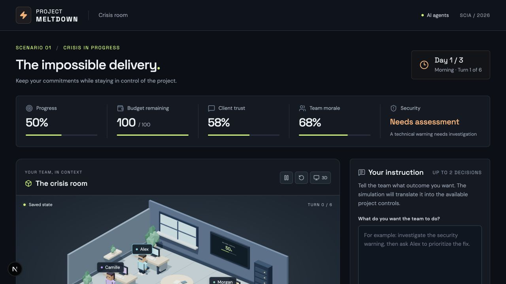
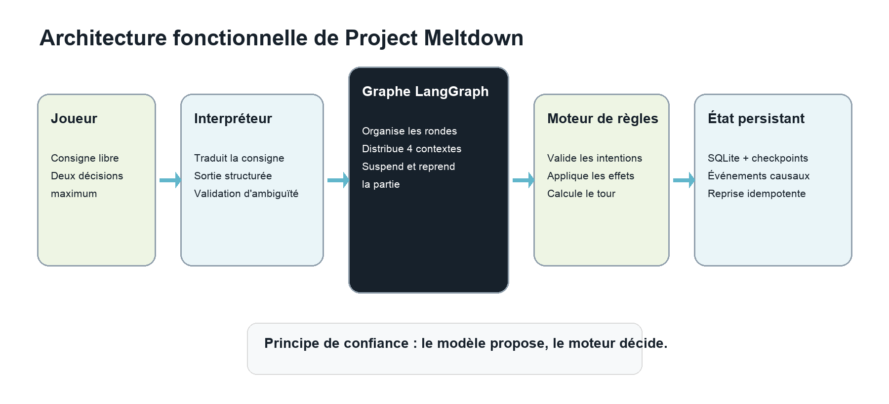
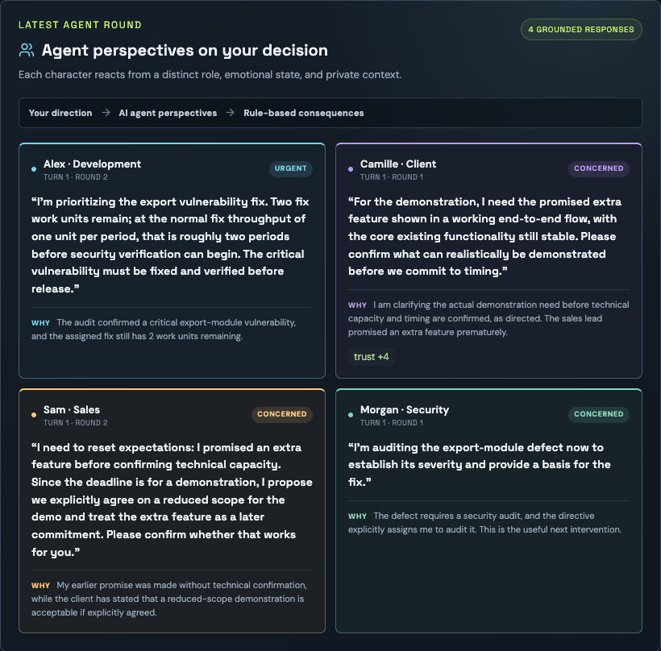
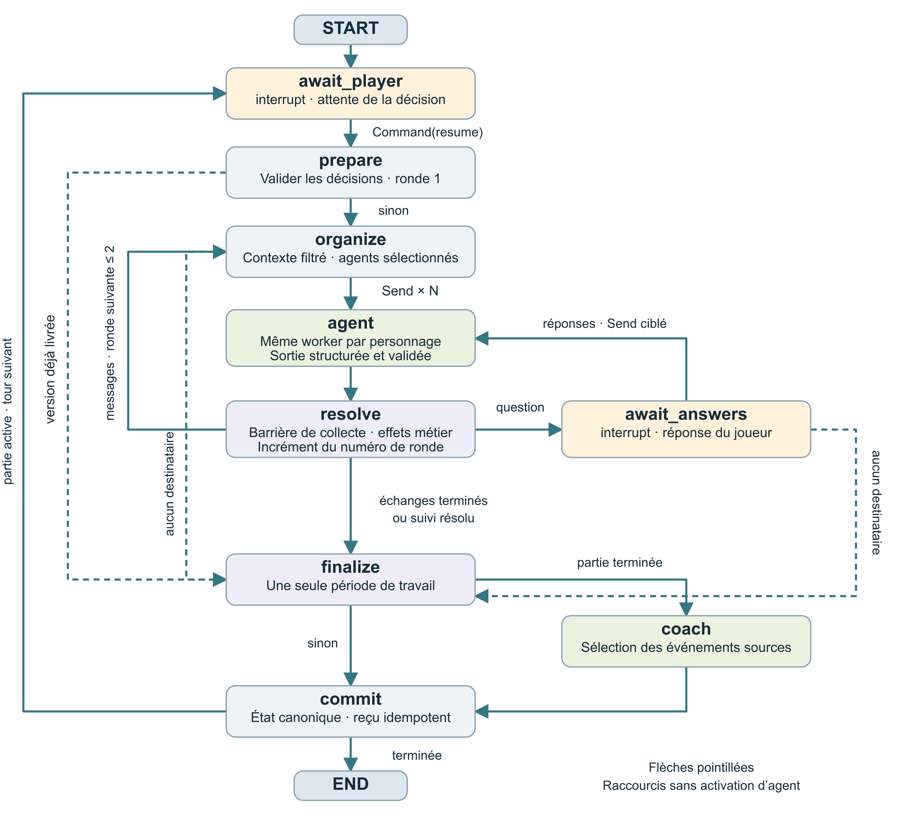
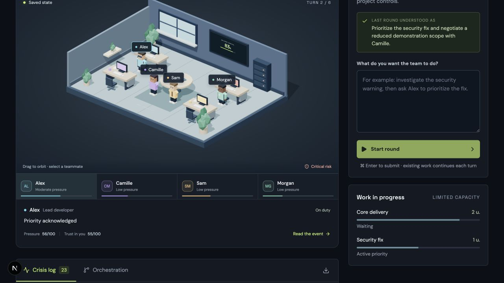
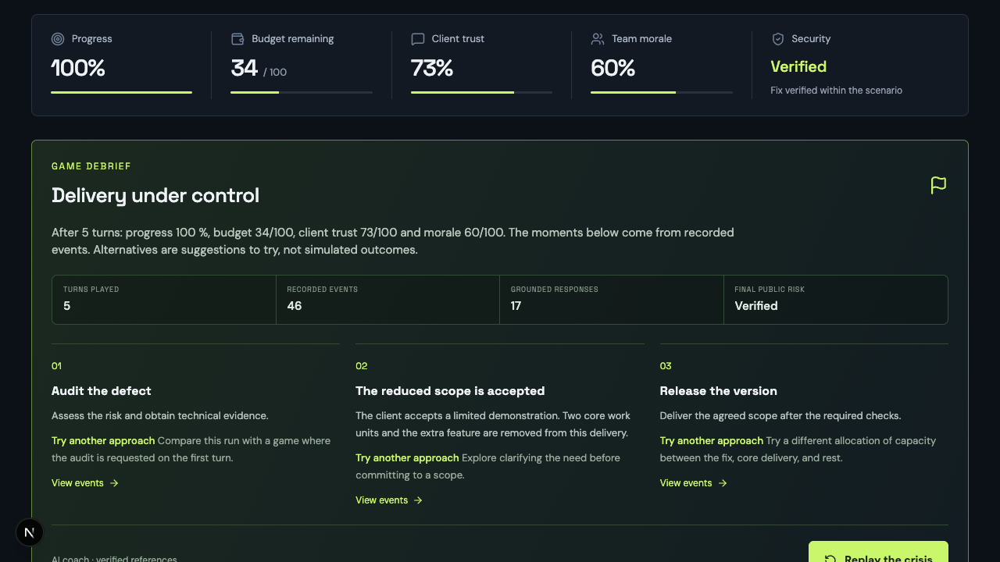

# Project Meltdown

Rapport technique du serious game

Hackathon SCIA 2026 · Arthur Lefebvre

## 1  Le projet et les règles du jeu

Project Meltdown simule la livraison d’un projet numérique sous pression. Le joueur incarne un Product Owner et donne des consignes en langage naturel à quatre personnages. L’architecture associe des modèles de langage pour interpréter et dialoguer, un moteur déterministe pour calculer les conséquences, et un graphe persistant pour coordonner les échanges.

*Figure 1 — Le tableau de commandement réunit la situation, les indicateurs et la consigne libre.*

Le joueur dispose de six tours et de deux décisions de gestion au maximum par tour. Il arbitre entre correctif de sécurité, avancement, périmètre client et charge de l’équipe. Livrer exige un périmètre accepté, le travail terminé et une validation de sécurité ; atteindre 100 % de progression ne suffit pas.

| Personnage | Responsabilité |
| --- | --- |
| Alex · Développement | Exécuter les priorités et signaler une charge insoutenable. |
| Camille · Client | Clarifier le besoin et négocier le périmètre ou le délai. |
| Sam · Commercial | Réconcilier la promesse initiale et les engagements. |
| Morgan · Sécurité | Auditer le défaut et vérifier la correction. |

L’intention pédagogique est d’apprendre par la décision, l’observation et la reprise d’une stratégie. Le débrief relie les arbitrages à leurs événements sources ; l’efficacité de cet apprentissage reste à évaluer avec des participants.

## 2  Architecture et moteur métier

Le navigateur présente le jeu et envoie les commandes au backend. Python concentre les règles, les appels LLM et la persistance. Cette séparation permet de faire varier les réponses des personnages tout en conservant des conséquences calculables et une trace commune à toute l’interface.

*Figure 2 — La consigne traverse des responsabilités distinctes avant la publication du nouvel état.*

| Couche | Technologies | Fonction |
| --- | --- | --- |
| Interface | Next.js · React · TypeScript | Saisie, polling, chronologie et débrief. |
| Bureau 3D | Three.js · React Three Fiber · Drei | Représentation interactive de l’état public. |
| API et contrats | FastAPI · Pydantic | Validation des requêtes et des réponses. |
| Agents | LangChain · modèle configuré | Interprétation et intentions structurées. |
| Orchestration | LangGraph | Distribution, interruptions et reprise. |
| Stockage | SQLite · checkpointer SQLite | État canonique, reçus et checkpoints. |

### Des effets calculés par le moteur

Le moteur vérifie les préconditions, applique les intentions acceptées, ajuste budget, confiance et moral, puis fait progresser le travail. Les tâches déjà engagées continuent d’un tour à l’autre. Le temps et les coûts périodiques avancent une seule fois, à la finalisation du tour. Une livraison valide, l’échéance ou une rupture de confiance mettent fin à la partie.

### Une projection publique explicite

La simulation conserve des connaissances propres aux personnages. La projection publique filtre l’état et les événements transmis au joueur ; elle alimente aussi la scène 3D. Les sorties verbales du modèle sont présentées séparément des faits écrits par le moteur, afin qu’une réplique ne devienne pas automatiquement une conséquence avérée.

## 3  Agents et contrats LLM

L’interpréteur transforme la consigne en zéro, une ou deux actions canoniques. Il reçoit les actions disponibles, les indicateurs, les tâches visibles, la sécurité connue et les huit derniers événements publics. Une ambiguïté demande une précision ou une confirmation sans consommer le tour ; une décision claire est validée par le moteur et résumée avec les titres canoniques.

Chaque personnage reçoit son rôle, sa pression, ses directives, sa mémoire récente et ses messages. Les faits transmis au modèle doivent être connus du personnage et visibles du joueur. Sa sortie comprend une action, une réplique, une raison, une émotion et, si nécessaire, un destinataire ou une question. Pydantic contrôle la structure ; les validations métier rejettent les actions indisponibles, les faits inconnus et les messages à soi-même.

*Figure 3 — Les réponses distinguent rôle, émotion, prise de position et justification.*

### Correction bornée et budget des appels

Une sortie invalide autorise une seule génération corrective, soumise aux mêmes contrôles. Un échec persistant conserve la reprise explicite, sans secours à règles. La configuration locale utilise openai:gpt-5.6-luna, raisonnement none, 384 tokens de sortie et un timeout de 20 secondes par tentative fournisseur. Chaque génération conserve une relance fournisseur : une décision logique peut donc atteindre quatre tentatives. Les erreurs fournisseur ne déclenchent pas la correction de sortie ; chaque génération traverse la mesure et le budget du script d’évaluation.

## 4  Le graphe LangGraph et sa persistance

Le graphe pilote l’exécution d’un tour. interrupt suspend le calcul jusqu’à la décision ou à la réponse du joueur ; Command le reprend depuis le checkpoint. Les nœuds ci-dessous correspondent aux fonctions de backend/meltdown/graph.py.

*Figure 4 — Nœuds, branches conditionnelles et boucles du graphe LangGraph courant.*

### Lire les étapes et les boucles

prepare valide les décisions ; organize filtre les observations et sélectionne les personnages. Send distribue le même worker agent en parallèle. resolve attend toutes les intentions, applique leurs effets puis choisit la suite : une seconde ronde de messages, une pause await_answers ou la finalisation. Après une réponse du joueur, seuls les demandeurs sont réactivés ; ce suivi rejoint ensuite finalize. Une livraison déjà validée contourne les agents. finalize fait avancer le temps une seule fois ; coach sélectionne les moments uniquement en fin de partie, puis commit enregistre l’état.

### Conserver et reprendre la partie

La boucle externe retourne à await_player tant que la partie reste active. SQLite conserve l’état canonique et les reçus ; un second fichier stocke les checkpoints. La version attendue évite les commandes périmées et l’identifiant de requête empêche de rejouer les effets. Le service sérialise les mutations en arrière-plan dans un seul processus ; le navigateur suit leur avancement par polling.

## 5  Interface et bureau 3D

L’interface organise la partie autour de la consigne libre, d’un reçu d’interprétation et d’une chronologie regroupée par tour et par ronde. Le panneau actif expose l’avancement du traitement, rassemble les questions et permet de reprendre une ronde interrompue. Le navigateur mémorise l’identifiant de la partie ; le serveur conserve son contenu.

*Figure 5 — La scène, les tâches et le journal décrivent le même état enregistré.*

### Une visualisation liée aux événements

Le bureau est construit avec des géométries low-poly locales, sans modèle 3D ni texture externe. Les quatre personnages sont sélectionnables ; leur fiche expose leur état et rejoint leur événement dans le journal. La pression influence leur présentation, les négociations publiques rapprochent les interlocuteurs et la sécurité vérifiée modifie le signal de livraison. Ces éléments illustrent la simulation et n’ajoutent aucun effet métier ni appel LLM.

### Une méthode par incréments vérifiables

Le projet a été réalisé par étapes jouables : scénario et règles, API et persistance, orchestration, consignes naturelles, puis bureau 3D. Les tests protègent les frontières métier et les reprises ; des parcours dans le produit complètent ces vérifications. L’assistance IA a contribué à la conception, au code, à la revue et à la documentation.

## 6  Débrief et validation

Le coach sélectionne jusqu’à trois moments parmi tous les événements pédagogiques publics éligibles, y compris les événements tardifs et les répétitions d’un même type. Les identifiants doivent être connus et uniques. Le texte factuel reste rédigé par le moteur ; les pistes alternatives proposent d’autres stratégies à essayer, sans prétendre simuler leurs résultats.

*Figure 6 — Exemple de débrief relié aux événements et aux indicateurs de la partie.*

### Ce que les vérifications établissent

La suite compte 56 tests backend et 10 tests frontend passants ; Ruff et le build de production Next.js réussissent. Les tests couvrent notamment les règles, la confidentialité, la persistance, la correction limitée des sorties LLM et la sélection du coach. Un test traverse le service pour vérifier qu’une correction n’ajoute ni tour ni coût ; un autre termine une partie et contrôle les événements transmis au coach.

Un parcours enregistré dans l’interface aboutit en cinq tours à 100 % de progression, un budget de 34/100, une confiance de 73/100, un moral de 60/100 et une sécurité vérifiée. Les captures illustrent ce parcours et des vues du prototype. Elles ne mesurent pas la fiabilité des prompts actuels : la campagne technique utilise des réponses fournisseur simulées, sans nouvel essai payant du contrat LLM.

Sources du projet : backend/meltdown/ pour les règles, contrats et orchestration ; web/ pour l’interface ; docs/evidence/llm-improvements-checks.txt pour les contrôles ; docs/model-calibration.md pour les mesures archivées. Les fichiers uv.lock et web/package-lock.json fixent les dépendances. Captures : docs/report-assets/.
